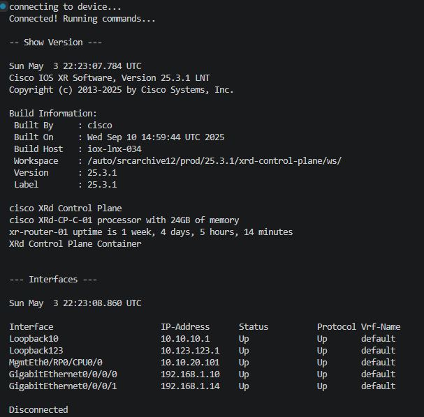
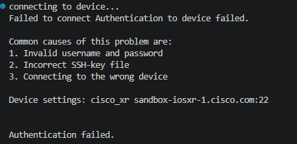

# Device Info Collector

## What it does
- logs into any device using SSH. Login credentials have to be specified


## Requirements
```
pip install netmiko
```

## Setup
1. Get your free Cisco DevNet sandbox credentials from devnetsandbox.cisco.com
2. Update the device credentials in `device_info.py`
3. Run the script

## How to run
```
python device_info.py
```

## Sample output





```
connecting to device...
Connected! Running commands...

-- Show Version ---

Sun May  3 22:23:07.784 UTC
Cisco IOS XR Software, Version 25.3.1 LNT
Copyright (c) 2013-2025 by Cisco Systems, Inc.

Build Information:
 Built By     : cisco
 Built On     : Wed Sep 10 14:59:44 UTC 2025
 Build Host   : iox-lnx-034
 Workspace    : /auto/srcarchive12/prod/25.3.1/xrd-control-plane/ws/
 Version      : 25.3.1
 Label        : 25.3.1

cisco XRd Control Plane
cisco XRd-CP-C-01 processor with 24GB of memory
xr-router-01 uptime is 1 week, 4 days, 5 hours, 14 minutes
XRd Control Plane Container


--- Interfaces ---

Sun May  3 22:23:08.860 UTC

Interface                      IP-Address      Status          Protocol Vrf-Name
Loopback10                     10.10.10.1      Up              Up       default 
Loopback123                    10.123.123.1    Up              Up       default 
MgmtEth0/RP0/CPU0/0            10.10.20.101    Up              Up       default 
GigabitEthernet0/0/0/0         192.168.1.10    Up              Up       default 
GigabitEthernet0/0/0/1         192.168.1.14    Up              Up       default 

Disconnected

```

## Concepts used
- Netmiko library
- Error handling
- Cisco CLI commands


## Why this matters":
- Manually SSHing into 50 devices takes hours.This script does it in seconds